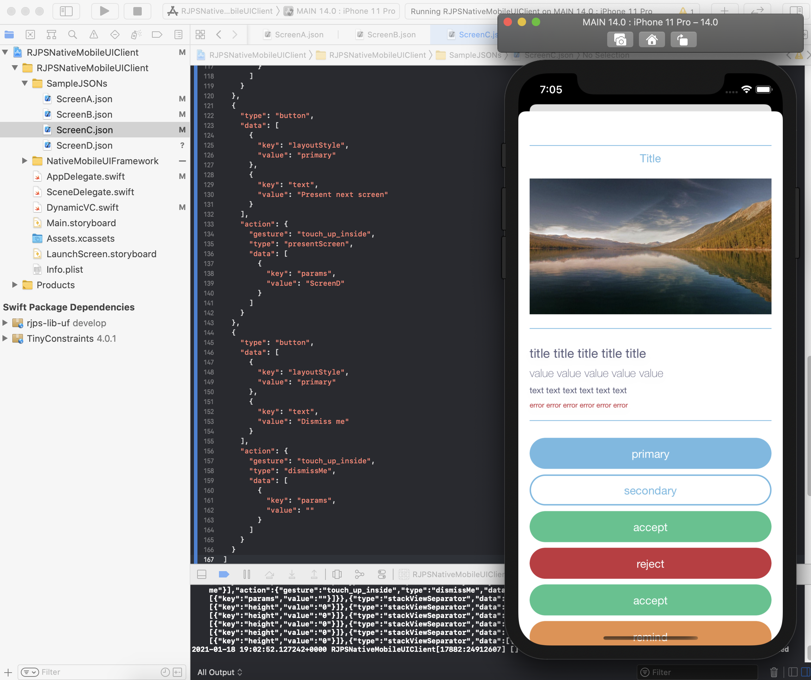

<p align="center">
   <a href="https://developer.apple.com/swift/">
      
   </a>
    <a href="https://developer.apple.com/swift/">
      
   </a>
   <a href="https://twitter.com/ricardo_psantos/">
      
   </a>
</p>

## About

_"Our framework enables us to specify our screen layouts using a common declarative language that can be understood by everyone - in this case JSON. Based on that declaration, it converts that definition of components into native code, rendering our design system components"_ 

Inspired by these words I read at [Implementing native UI from scratch using JSON](https://www.farfetchtechblog.com/en/blog/post/implementing-native-ui-from-scratch-using-json/), I decided to give it a try and see how far could I go. 

## Current capabilities

✅ Add elements on a vertical layout.

✅ Add elements with properties and styles.

✅ Elements support user interactions (now, only for buttons).

✅ Added push and dismiss screen support.

❌ Add relative/horizontal layout options (on roadmap)

❌ Add input fields support (on roadmap)

## Version 1.4.0

* Added push and dismiss screen support.
* General bug fixs.
* Code re-engerier.




## JSON Sampes

__Sections__

```json
{ 
  "type": "stackViewSection",
  "data": [{"key": "text", "value": "Section title"}]
}
```

```json
{ 
  "type": "stackViewSection"
}
```

__Vertical Space__

```json
{
  "type": "stackViewSeparator",
  "data": [{"key": "height","value": "0"}]
}
```

__UILabel__

```json
{
  "type": "label",
    "data": [
      {"key": "text", "value": "I'm a title"},
      {"key": "layoutStyle", "value": "title" }
    ]
}
```

__UIImageView__

```json
{
  "type": "imageView",
  "data": [{"key": "url", "value": "https://cdn.vox-cdn.com/thumbor/zEZJzZFEXm23z-Iw9ESls2jYFYA=/89x0:1511x800/1600x900/cdn.vox-cdn.com/uploads/chorus_image/image/55717463/google_ai_photography_street_view_2.0.jpg"}]
}
```

__Button__

```json
{
  "type": "button",
  "data": [
    {"key": "layoutStyle", "value": "primary"},
    {"key": "text", "value": "Present next screen"}
  ],
  "action": {
    "gesture": "touch_up_inside",
    "type": "presentScreen",
    "data": [{"key": "params", "value": "ScreenC"}]}
  }
```


## Old versions

### Version 1.3.0

* Added ImageView support.

### Version 1.2.0

* Ability to have multiple screens and load then.

### Version 1.1.0

* UI elements with user interactions  (only for buttons)

### Version 1.0.0

* Adding UI elements on vertical layouts.
* UI elements with properties and styles.


