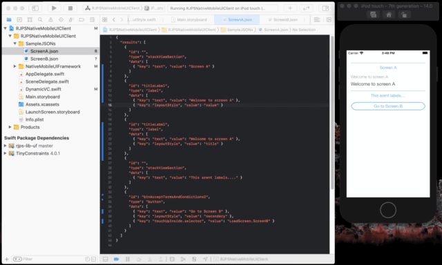
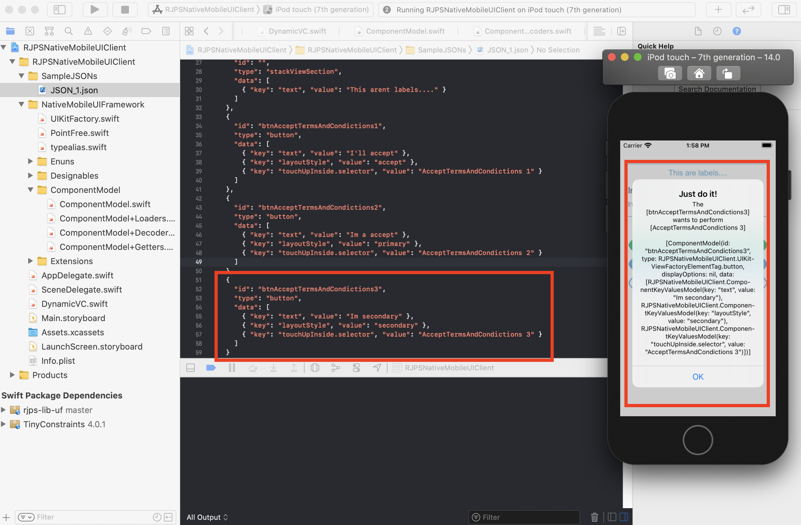
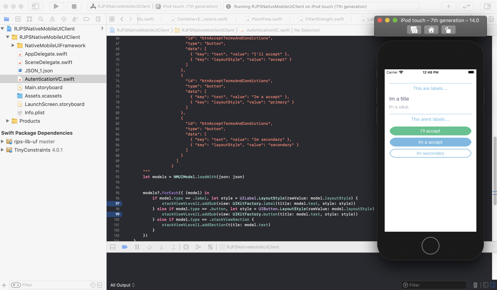

   
    
   
   

## About

Inspired on [Implementing native UI from scratch using JSON](https://www.farfetchtechblog.com/en/blog/post/implementing-native-ui-from-scratch-using-json/) I decided to give it a try and see how far could I go. 

## Version 1.2.0

✅ Adding UI elements on vertical layouts 

✅ UI elements with properties and styles

✅ UI elements with user interactions  (only for buttons)

✅ Hability to have multiple screens and load then

❌ Add relative layout option (on road map)

## Version 1.1.0

✅ Adding UI elements on vertical layouts

✅ UI elements with properties and styles

✅ UI elements with user interactions  (only for buttons)

❌ Add relative layout option (on road map)

## Version 1.0.0

✅ Adding UI elements on vertical layouts

✅ UI elements with properties and styles

❌ UI elements with user interactions  (on road map)

❌ Add relative layout option (on road map)

